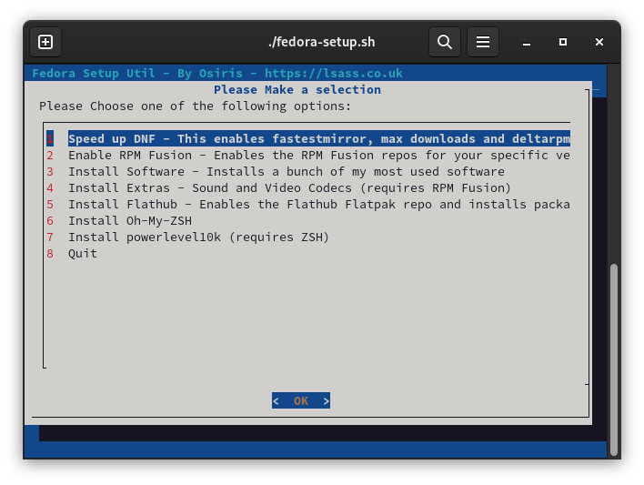

# Fedora-Setup a Post Install Helper Script

## What's all this then?

Fedora-Setup is a personal script I created to help with post install tasks such as tweaks and software installs. It's written in Bash and utilises Dialog for a friendlier menu system.

Dialog must be installed for the menu system to work and as such the script will check to see if Dialog is installed. If not, it will ask you to install it.

## Usage

1. Set the script to be executable `chmod -x fedora-setup.sh` \
2. Run the script `./fedora-setup.sh`

## Files

- **dnf-packages.txt** - This file contains a list of all applications that will be installed via the Fedora and RPMFusion repositories.
- **flatpak-packages.txt** - This file contains a list of all flat packages to install you can customise this with your choice of applications by application-id.

## Screenshot

## Options

### Speed up DNF
  - **Enables fastest mirror**
  - **Sets max parallel downloads to 10**
  - **Enables DeltaRPMs**

### Enable RPM Fusion
  - Enables RPM Fusion repositories using the official method from the RPM Fusion website. - [RPM Fusion](https://rpmfusion.org)
  > RPM Fusion provides software that the Fedora Project or Red Hat doesn't want to ship. That software is provided as precompiled RPMs for all current Fedora versions and current Red Hat Enterprise Linux or clones versions; you can use the RPM Fusion repositories with tools like yum and PackageKit.

### Install Software
#### Installs the following pieces of software (or the applications you specify in dnf-packages.txt)
  - **bottles** - [Easily run Windows software on Linux with Bottles!](https://usebottles.com/)
  - **deja-dup** - [Easy to use backup tool from the GNOME project](https://wiki.gnome.org/Apps/DejaDup)
  - **discord** - [The popular VoIP, IM and Social platform](https://discord.com)
  - **fragments** - [Easy to use BitTorrent client](https://gitlab.gnome.org/World/Fragments)
  - **gimp** - [GNU Image Manipulation Program](https://gimp.org)
  - **gnome-extensions-app** - Gnome extension management application
  - **gnome-tweaks** - Gnome shell tweak tool
  - **lutris** - [Open gaming platform for Linux](https://lutris.net/)
  - **steam** - [The Steam digital distribution service](https://store.steampowered.com/)
  - **wine** - [Compatibility layer capable of running Windows applications](https://www.winehq.org/)
  - **winetricks** - [Helper scripts for Wine](https://wiki.winehq.org/Winetricks)

### Install Extras
#### Installs the following extras ([reference](https://docs.fedoraproject.org/en-US/quick-docs/assembly_installing-plugins-for-playing-movies-and-music/))
  - **gstreamer plugins**
  - **lame**
  - **Multimedia group**

### Enable Flatpak and Packages
#### Adds the flatpak repo, updates and installs the following packages (or what you ahve specified in flatpak-packages.txt)
  - **ATLauncher** - [Minecraft modpack launcher](https://atlauncher.com/)
  - **Flatseal** - [Manage Flatpak permissions](https://flathub.org/apps/details/com.github.tchx84.Flatseal)
  - **OpenRCT2** - [Open-source re-implementation of RollerCoaster Tycoon 2](https://openrct2.org/)
  - **Signal Desktop** - [A cross platform secure messaging service](https://signal.org/en/download/)
  - **VSCodium** - [Free/Libre open source software binaries of Microsoft's VS Code](https://vscodium.com/)

### Install Oh-My-ZSH
  - **Installs Oh-My-Zsh** - [A ZSH configuration management framework](https://ohmyz.sh/)

### Install powerlevel10k Prompt
  - **Installs the powerlevel10k prompt for ZSH** - [A popular cross-shell highly customisable prompt](https://github.com/romkatv/powerlevel10k)
